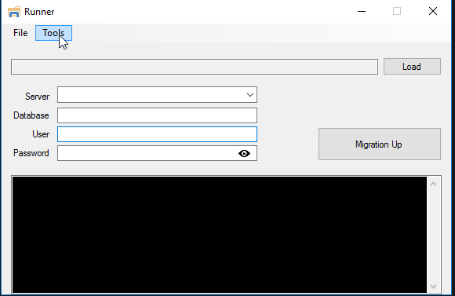

# MigrationRunner

MigrationRunner GUI application for FluentMigrator migration runs manually 

The application requires the WebDbMigrations.dll file which can be found in the CoreAutoUpdates release.